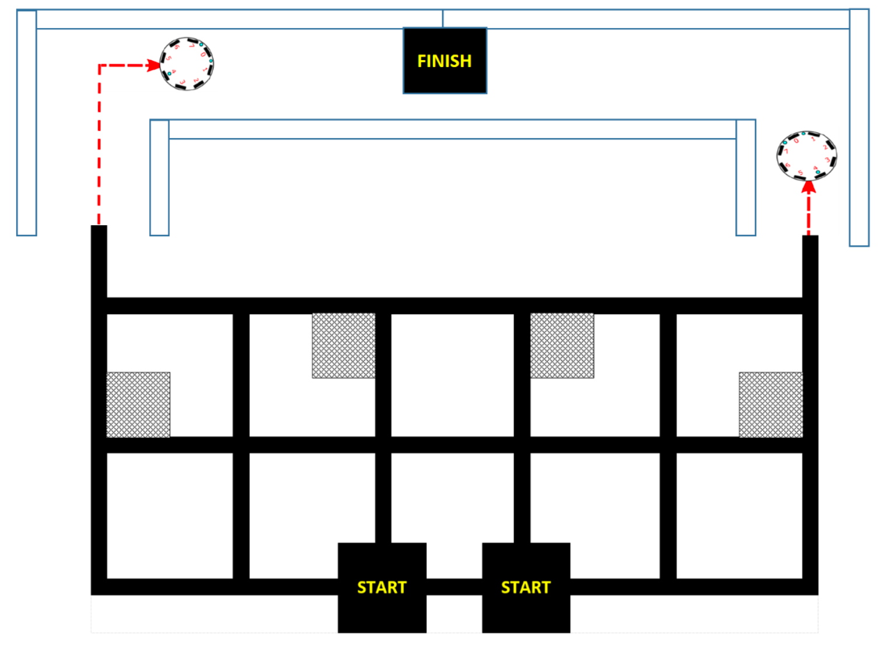

 


- [Introduction](#introduction)
- [Challenge 1 - Line follower, Part 1](#challenge-1---line-follower-part-1)
  - [Description](#description)
  - [Results](#results)
- [Challenge 2 - Line follower, Part 2](#challenge-2---line-follower-part-2)
  - [Description](#description-1)
  - [Results](#results-1)
- [Challenge 3 - Stay inside box and obstacle avoidance](#challenge-3---stay-inside-box-and-obstacle-avoidance)
  - [Description](#description-2)
  - [Results](#results-2)
- [Challenge 4 - Line and corridor follower](#challenge-4---line-and-corridor-follower)
  - [Description](#description-3)
  - [Results](#results-3)
- [Conclusion](#conclusion)

# Introduction

This report is about the lab work of Embedded System. There are four challenges in this lab work:
- [Challenge 1 - Line follower, Part 1](#challenge-1---line-follower-part-1)
- [Challenge 2 - Line follower, Part 2](#challenge-2---line-follower-part-2)
- [Challenge 3 - Stay inside box and obstacle avoidance](#challenge-3---stay-inside-box-and-obstacle-avoidance)
- [Challenge 4 - Line and corridor follower](#challenge-4---line-and-corridor-follower)

Knowledge we learned from the class, like PWM, finite state machine and threasholding measure, are used in this lab. The main goal of this lab is to make the robot move in a certain way, like following a line, staying inside a box, avoiding obstacles, and following a corridor.

All the challenges have been tested successfully on the ELISA-3 robot.

Only core codes are shown in this report. For the full code, please refer to the [GitHub](https://github.com/Jing-yilin/Embedded-System-Lab) or the code files uploaded on the Canvas.
# Challenge 1 - Line follower, Part 1


## Description

Challenge 1 aims to **make the robot follow a black line of a rounded shape, based on threashold values of the ground sensors**. Ground LEDs emit light to the ground, and the ground sensors will detect the reflected light. 

The main priciple is that **the ground sensors will detect a higher value if the ground is black, and a lower value if the ground is white**. The robot will move forward if both ground sensors detect white, turn left if the left ground sensor detects black, and turn right if the right ground sensor detects black.

**PWM control** is used to control the speed of the robot.

## Results

Firstly, I have to make sure the car can **move forward in a straight line**.  **I use a duty cycle of 0.09 (9%), which is `float duty = 0.09;`, to make sure the car moves forward not too fastly or too slowly**. However, the car does not move in a straight line at times. It may turn left or turn right. Thus, **I add other two variables `float left_adjust = 1.20;` and `float right_adjust = 1.22;` to adjust the speed of the left and right motor respectively**. Therefore, the car moves in a straight line after the adjustment.

Secondly, **black line threashold values of the ground sensors need to be determined.** I put the robot on the black line, and the values of the ground sensors are read and printed to the serial monitor. The values of the ground sensors are around 900 (threashold values are not stable and vary among the robots), so **I set the black line threashold values to 900, `int blackThreashold[4] = {900, 900, 900, 900};`.**

Furthermore, I **use a green LED to indicate the status of the robot**. The green LED will be on if the robot detects a black line, and off if the robot detects a white line.

All the global variables are as below:

```c
unsigned char pwm_right = 5;               // pin number to control the right motor
unsigned char dir_right = 2;               // pin number to control the right motor
unsigned char pwm_left = 6;                // pin number to control the left motor
unsigned char dir_left = 7;                // pin number to control the left motor

int groundIRSensor[4] = {8, 9, 10, 11};    // 4 ground IR proximity sensor
int line[4] = {};                          // store the value of ground IR sensor
int blackThreashold[4] = {900, 900, 900, 900}; // the threshold of black line

float duty = 0.09;                         // duty cycle
float left_adjust = 1.20;                  // adjust the left motor
float right_adjust = 1.22;                 // adjust the right motor

```

However, I want to mention that although four ground sensors are used, **only two sensors values (sensor 1 and sensor 2) are utilized** to determine the black line. Other two sensor values will be used in Challenge 2 to detect big angles.

Cosequently, the robot can follow a black line with the following main code (only main loop are shown):


```c
/*************** main loop Control ***************/

void loop()
{
    readGroundIRSensors(); // read the value of ground IR sensor
    moveForward(duty);     // move forward

    if (line[1] > blackThreashold[1]) // black line on left
    {
        greenLEDon();   // turn on the green LED
        leftTurn(duty); // turn left
    }
    else
    {
        greenLEDoff(); // turn off the green LED
    }
    if (line[2] > blackThreashold[2]) // black line on right
    {
        greenLEDon();    // turn on the green LED
        rightTurn(duty); // turn right
    }
    else
    {
        greenLEDoff(); // turn off the green LED
    }
}
```


# Challenge 2 - Line follower, Part 2


## Description

Challenge 2 **extends the line follower in Challenge 1 to a more complex shape** with big angles, so the variables are the same. Comparing to Challenge 1, where only ground sensor 1 and 2 are used, **Challenge 2 uses all four ground sensors**.

The robot will move forward if all the ground sensors detect white, turn left if the  ground sensor 1 detects black, and turn right if the ground sensor 2 detects black. The robot can also detect big angles with ground sensor 0 and ground sensor 3. It will turn left and right in a big angle if the sensor 0 and sensor 3 detect black respectively.

## Results

Most of the code is the same as Challenge 1. The main difference is that the robot can detect big angles with ground sensor 0 and ground sensor 3. So I add two other functions `void leftTurnBigAngle(float duty)` and `void rightTurnBigAngle(float duty)` to turn left and right in a big angle.

The robot can follow a black line in Challeng 2 with the following main code (only global variables, stepup and main loop are shown):

```c
/*************** main loop Control ***************/

void loop()
{
    readGroundIRSensors();          // read the value of ground IR sensor
    moveForward(duty);              // move forward
    /**
     * 1. Control the big angle
     */
    if (line[0] > blackThreashold[0]) // black line on the most left sensor
    {
        leftTurnBigAngle(duty); // turn left with big angle
        greenLEDon(0);          // turn on the green LED 0
    }
    else
    {
        greenLEDoff(0); // turn off the green LED 0
    }
    if (line[3] > blackThreashold[3]) // black line on the most right sensor
    {
        rightTurnBigAngle(duty); // turn right with big angle
        greenLEDon(3);           // turn on the green LED 3
    }
    else
    {
        greenLEDoff(3); // turn off the green LED 3
    }
    /**
     * 2. Control the small angle
     */
    if (line[1] > blackThreashold[1]) // black line on left
    {
        greenLEDon(1);  // turn on the green LED 1
        leftTurn(duty); // turn left
    }
    else
    {
        greenLEDoff(1); // turn off the green LED 1
    }
    if (line[2] > blackThreashold[2]) // black line on right
    {
        greenLEDon(2);   // turn on the green LED 2
        rightTurn(duty); // turn right
    }
    else
    {
        greenLEDoff(2); // turn off the green LED 2
    }
}
```


# Challenge 3 - Stay inside box and obstacle avoidance


## Description

Challenge 3 aims to **control the robot driving in a black-bodered box and avoid the obstacles**. The robot starts off inside the box and should turn random angle when it detects the black line edge. At the same time, the robot should avoid two obstacles in the box.

**Obstable avoidance algorithm** is implemented by using the proximity sensors and **border detection algorithm** is implemented by using the ground IR sensors.

## Results

Firstly, based on the vairables in Challenge 1 and 2, we have two add extra viriable to store proximity related values:

```c
int proximityIRSensor[8] = {0, 1, 2, 3, 4, 5, 6, 7};      // 8 IR proximity sensor
int proximityIRLed[8] = {22, 23, 24, 25, 26, 27, 28, 29}; // 8 IR LED
int proximity[8] = {};                            // store the value of IR sensor
int distanceThreashold_15mm = 800;                // the threshold of 15mm
```

It is crucial to **find the mathematic relationship between the distance and the value of proximity sensor**. By detecting and recording the value of proximity sensor at different distance, we can plot the graph of the relationship between the distance and the value of proximity sensor using MATLAB. The table and graph are shown below.

| Real Distance (mm) | Proximity Sensor Value |
| :----------------: | :--------------------: |
|         2          |           53           |
|         4          |           75           |
|         6          |          475           |
|         8          |          560           |
|         10         |          674           |
|         14         |          786           |
|         16         |          807           |
|         18         |          846           |
|         22         |          868           |
|         24         |          879           |


$$
y(x) = 0.02161x -0.6154
$$

Thus, we can define a function to transform the value of IR proximity sensor to the real distance:

```c
/**
 * @brief Calculate the real distance from IR proximity sensor value
 */
double getRealProximity(int proximityValue)
{
    double realProximity = 0.02161 * proximityValue + -0.6154;
    return realProximity;
}
```

Nevertheless, this **formula is not accurate enough**. Therefore, it is better to define a fixed threshold value to determine whether the robot is close to the obstacle or not. The threshold is set to 15 cm by testing, which is `int distanceThreashold_15mm = 800;  `.

Since we have determined the threshold of the ground IR sensors in Challenge 1 and 2, **we can use the same threshold values in Challenge 3**.

Following the instruction, the robot should turn random angle when it detects the black line edge. By defining `float random_angle = random(15, 25) / 10.0;`, The random angle is set to be between 1.5 and 2.5 seconds.

Consequently, the **obstacle avoidance algorithm** (only the core part) is implemented as follows:

```c
/**
 * 1. Avoidance algrithm
 */
if (proximity[0] < distanceThreashold_15mm) // IR sensor 0 is very close to the wall
{
    leftTurnInPlace(duty * 1.6);
    delay(30);
    moveForward(duty);
    delay(5);
}
if (proximity[1] < distanceThreashold_15mm) // IR sensor 1 is very close to the wall
{
    leftTurn(duty);
    delay(5);
}
if (proximity[7] < distanceThreashold_15mm + 150) // IR sensor 7 is very close to the wall
{
    rightTurn(duty);
    delay(5);
}
if (proximity[2] < distanceThreashold_15mm) // IR sensor 2 is very close to the wall
{
    leftTurn(duty);
    delay(5);
}
if (proximity[6] < distanceThreashold_15mm) // IR sensor 6 is very close to the wall
{
    rightTurn(duty);
    delay(5);
}
```

And the **border detection algorithm** (only the core part) is implemented as follows:

```c
/**
 * 2. Border detection algrithm
 */
if (line[1] > blackThreashold[1]) // black line on left
{
    greenLEDon(1);
    rightTurnInPlace(duty * random_angle); // turn right in random angle
    delay(20);
    moveForward(duty);
    delay(5);
}
else
{
    greenLEDoff(1);
}

if (line[2] > blackThreashold[2]) // black line on right
{
    greenLEDon(1);
    leftTurnInPlace(duty * random_angle); // turn left in random angle
    delay(20);
    moveForward(duty);
    delay(5);
}
else
{
    greenLEDoff(1);
}

if (line[1] > blackThreashold[1] & line[2] > blackThreashold[2]) // The car has reached the corder
{
    greenLEDon(1);
    rightTurnInPlace(duty * random_angle); // turn right in random angle
    delay(40);
    moveForward(duty);
    delay(5);
}
else
{
    greenLEDoff(1);
}
```


# Challenge 4 - Line and corridor follower



## Description

Challenge 4 is a comprehensive challenge which aims to detect the black line, corner and the obstacles. Although the task has to be completed in CW and and CCW direction, the algorithm logic is the same. Therefore, only the CW direction will be explained in this report.

The task can be devided into 2 parts:
- line-following part
- wall-following part

At the beginning, the robot starts off at the left START spot, and it should follow the black line and turn left at the 1st corner. Then, it should turn right at the 2nd corner, turn left at the 3rd corner and turn right at the 4th corner, while avoiding the obstacles.

After it leaves the line-following part, it should follow the wall and turn left at the 5th corner. Finally, it should stop
at the FINISH spot coloured in black.

## Results

Until now, **we have already implemented the line-following algorithm and obstacle avoidance algorithm**. Therefore, we should **focus on the corner detection and the entire working strategy**.

To find the corner, we use the ground sensor 0 and 3 to detect the black line on the most left and right sides of the robot. If both of the sensors detect the black line, it means that the robot has reached the corner. 

**The corner finding algorithm** is implemented as follows:

```c
/**
 * @brief Check if the robot is at the corner
 * @return true if the robot is at the corner
 */
bool isCorner()
{
    if (line[0] > blackThreashold[0] & line[3] > blackThreashold[3])
    {
        return true;
    }
    else
    {
        return false;
    }
}
```

We also need a function to check if the robot has reached the FINISH spot. 

**The destinatoin finding algorithm** is implemented as follows:

```c
/**
 * @brief Check if the robot is at the destination
 * @return true if the robot is at the destination
 */
bool isDestination()
{
    if (line[0] > blackThreashold[0] & line[1] > blackThreashold[1] & line[2] > blackThreashold[2] & line[3] > blackThreashold[3])
    {
        return true;
    }
    else
    {
        return false;
    }
}
```

Futhremore, I need explain three extra variables:
```c
int count_corner = 0;     // count the number of corner
int state = 0;            // state of the robot
int count_loop = 0;       // count the number of loop
```
- `count_corner` is used to count the number of corner. When the robot reaches the corner, `count_corner` will increase by 1.
- `state` is used to record the state of the robot. The robot **has 5 states**: 
  - Move Forward by Black Line: `moveForwardSteadyByBlackLine()`
  - Turn Left:  `turnLeft90DegreeAtCorner()`
  - Turn Right:  `turnRight90DegreeAtCorner()`
  - Move Forward by Proximity: `moveForwardSteadyByProximity()`
  - Stop: `stop()`
- `count_loop` is used to **count the number of loop**, and make sure every state transfer have 20 loops of delay (a few ms) from the last state, so the **robot will not repeat the same state in the next loop**.

For the entire working strategy, I use a **finite state machine** to control the robot, which can be illustrated as follows graph:


The **main loop** is implemented as follows:

```c
/*************** main loop Control ***************/

/*************** main loop Control ***************/

void loop()
{
    count_loop++;             // count the number of loop, used for delay
    readGroundIRSensors();    // read the ground IR sensors
    readProximityIRSensors(); // read the proximity IR sensors

    /**
     * switch th state of the robot
     */
    switch (state)
    {
    case 0: // Move Forward base on BlackLine
        moveForwardSteadyByBlackLine(duty);
        break;
    case 1: // Turn Left base on BlackLine
        turnLeft90DegreeAtCorner(duty*1.6);
        state = 0;
        break;
    case 2: // Turn Right base on BlackLine
        turnRight90DegreeAtCorner(duty*1.6);
        state = 0;
        break;
    case 3: // Move Forward base on avoidance
        moveForwardSteadyByProximity(duty);
        break;
    case 4: // Stop
        stop();
        delay(100000);
        break;
    default:
        break;
    }

    /**
     * check the state of the robot
     */
    if (isCorner() & count_corner == 0 & count_loop > 20) // meet the 1st corner
    {
        greenLEDon(1);
        state = 1; // turn left
        count_corner++;
        count_loop = 0;
    }
    else if (isCorner() & count_corner == 1 & count_loop > 20) // meet the 2nd corner
    {
        greenLEDon(2);
        state = 2; // turn right
        count_corner++;
        count_loop = 0;
    }
    else if (isCorner() & count_corner == 2 & count_loop > 20) // meet the 3rd corner
    {
        greenLEDon(3);
        state = 1; // turn left
        count_corner++;
        count_loop = 0;
    }
    else if (isCorner() & count_corner == 3 & count_loop > 20) // meet the 4th corner
    {
        greenLEDon(4);
        state = 2; // turn right
        count_corner++;
        count_loop = 0;
    }
    else if (isDestination() & count_corner == 4 & count_loop > 20) // meet the destination
    {
        greenLEDon(5);
        state = 4; // stop
    }

    if (count_corner >= 4 & count_loop == 20) // After the 4th corner, the robot will move forward based on avoidance
    {
        state = 3; // To move forward based on avoidance
    }
}
```


# Conclusion

In this project, I have implemented the **line-following algorithm** in Challenge 1 and 2, and the **obstacle avoidance algorithm** in Challenge 3. In Challenge 4, I have implemented the entire working strategy, which is a combination of line-following and obstacle avoidance.

After completing all the challenges, I come to realize that the **encapsulation** of the code is very important. Also, the code should be **well-organized** and easy to read. In addition, I have learned how to use the finite state machine to control the robot, which is a very useful skill in the future.

It is quite defferent between an ideal test environment and a real test environment. In the ideal test environment, the robot can work very well. However, in the real test environment, the robot may not work as well as in the ideal test environment, mainly because of **the friction between the robotand the ground, the uncertain reflectivity of the ground, and the accuracy of the sensors**. Therefore, it always takes time to adjust the parameters of the robot to make it work well in the real test environment.

