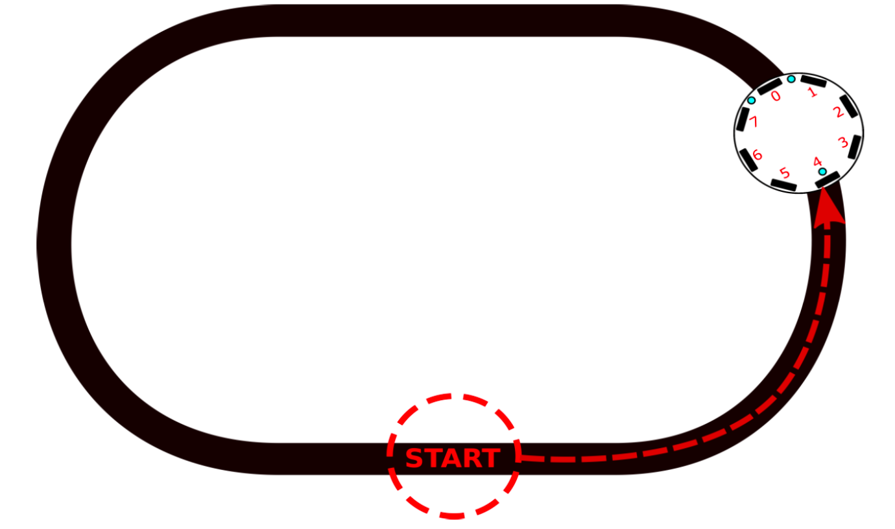
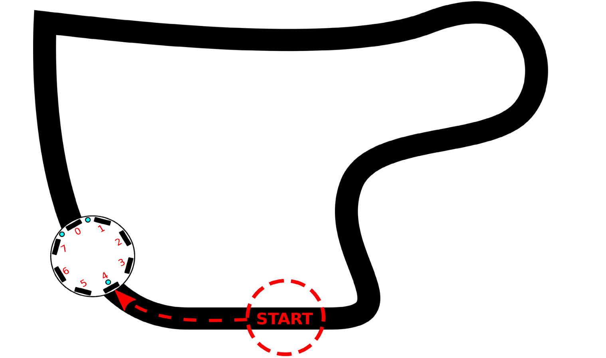
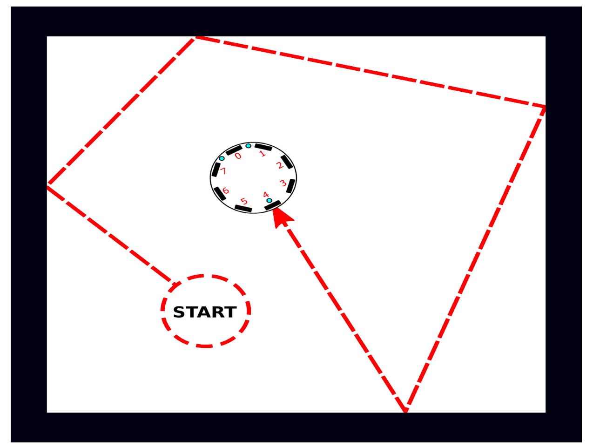
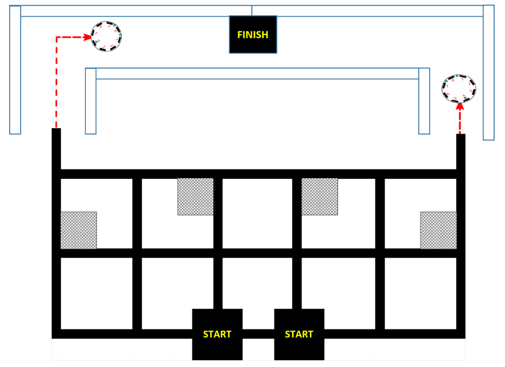

- [Introduction](#introduction)
- [Challenge 1 - Line follower, Part 1](#challenge-1---line-follower-part-1)
  - [Description](#description)
  - [Results](#results)
- [Challenge 2 - Line follower, Part 2](#challenge-2---line-follower-part-2)
  - [Description](#description-1)
  - [Results](#results-1)
- [Challenge 3 - Stay inside box and obstacle avoidance](#challenge-3---stay-inside-box-and-obstacle-avoidance)
  - [Description](#description-2)
  - [Results](#results-2)
- [Challenge 4 - Line and corridor follower](#challenge-4---line-and-corridor-follower)
  - [Description](#description-3)
  - [Results](#results-3)
- [Conclusion](#conclusion)

This lab report has been published on [GitHub](https://github.com/Jing-yilin/Embedded-System-Lab#challenge-1---line-follower-part-1) of Jing-yilin.

# Introduction


# Challenge 1 - Line follower, Part 1



## Description

Challenge 1 aims to **make the robot follow a black line of a rounded shape, based on threashold values of the ground sensors**. Ground LEDs emit light to the ground, and the ground sensors will detect the reflected light. 

The main priciple is that **the ground sensors will detect a higher value if the ground is black, and a lower value if the ground is white**. The robot will move forward if both ground sensors detect white, turn left if the left ground sensor detects black, and turn right if the right ground sensor detects black.

**PWM control** is used to control the speed of the robot.

## Results

Firstly, I have to make sure the car can **move forward in a straight line**.  **I use a duty cycle of 0.09 (9%), which is `float duty = 0.09;`, to make sure the car moves forward not too fastly or too slowly**. However, the car does not move in a straight line at times. It may turn left or turn right. Thus, **I add other two variables `float left_adjust = 1.20;` and `float right_adjust = 1.22;` to adjust the speed of the left and right motor respectively**. Therefore, the car moves in a straight line after the adjustment.

Secondly, **black line threashold values of the ground sensors need to be determined.** I put the robot on the black line, and the values of the ground sensors are read and printed to the serial monitor. The values of the ground sensors are around 900 (threashold values are not stable and vary among the robots), so **I set the black line threashold values to 900, `int blackThreashold[4] = {900, 900, 900, 900};`.**

Furthermore, I **use a green LED to indicate the status of the robot**. The green LED will be on if the robot detects a black line, and off if the robot detects a white line.

However, I want to mention that although four ground sensors are used, **only two sensors values (sensor 1 and sensor 2) are utilized** to determine the black line. Other two sensor values will be used in Challenge 2 to detect big angles.

Cosequently, the robot can follow a black line with the following main code (only main loop are shown):


```c
/*************** main loop Control ***************/

void loop()
{
    readGroundIRSensors(); // read the value of ground IR sensor
    moveForward(duty);     // move forward

    if (line[1] > blackThreashold[1]) // black line on left
    {
        greenLEDon();   // turn on the green LED
        leftTurn(duty); // turn left
    }
    else
    {
        greenLEDoff(); // turn off the green LED
    }
    if (line[2] > blackThreashold[2]) // black line on right
    {
        greenLEDon();    // turn on the green LED
        rightTurn(duty); // turn right
    }
    else
    {
        greenLEDoff(); // turn off the green LED
    }
}
```

<video src="./video/Challenge1.mp4"></video>


# Challenge 2 - Line follower, Part 2



## Description

Challenge 2 **extends the line follower in Challenge 1 to a more complex shape** with big angles. Comparing to Challenge 1, where only ground sensor 1 and 2 are used, **Challenge 2 uses all four ground sensors**.

The robot will move forward if all the ground sensors detect white, turn left if the  ground sensor 1 detects black, and turn right if the ground sensor 2 detects black. The robot can also detect big angles with ground sensor 0 and ground sensor 3. It will turn left and right in a big angle if the sensor 0 and sensor 3 detect black respectively.

## Results

Most of the code is the same as Challenge 1. The main difference is that the robot can detect big angles with ground sensor 0 and ground sensor 3. So I add two other functions `void leftTurnBigAngle(float duty)` and `void rightTurnBigAngle(float duty)` to turn left and right in a big angle.

The robot can follow a black line in Challeng 2 with the following main code (only global variables, stepup and main loop are shown):

```c
/*************** main loop Control ***************/

void loop()
{
    readGroundIRSensors();          // read the value of ground IR sensor
    moveForward(duty);              // move forward
    /**
     * 1. Control the big angle
     */
    if (line[0] > blackThreashold[0]) // black line on the most left sensor
    {
        leftTurnBigAngle(duty); // turn left with big angle
        greenLEDon(0);          // turn on the green LED 0
    }
    else
    {
        greenLEDoff(0); // turn off the green LED 0
    }
    if (line[3] > blackThreashold[3]) // black line on the most right sensor
    {
        rightTurnBigAngle(duty); // turn right with big angle
        greenLEDon(3);           // turn on the green LED 3
    }
    else
    {
        greenLEDoff(3); // turn off the green LED 3
    }
    /**
     * 2. Control the small angle
     */
    if (line[1] > blackThreashold[1]) // black line on left
    {
        greenLEDon(1);  // turn on the green LED 1
        leftTurn(duty); // turn left
    }
    else
    {
        greenLEDoff(1); // turn off the green LED 1
    }
    if (line[2] > blackThreashold[2]) // black line on right
    {
        greenLEDon(2);   // turn on the green LED 2
        rightTurn(duty); // turn right
    }
    else
    {
        greenLEDoff(2); // turn off the green LED 2
    }
}
```

<video src="./video/Challenge2.mp4"></video>

# Challenge 3 - Stay inside box and obstacle avoidance



## Description

Challenge 3 aims to **control the robot driving in a black-bodered box and avoid the obstacles**. The robot starts off inside the box and should turn random angle when it detects the black line edge. At the same time, the robot should avoid two obstacles in the box.

**Obstable avoidance algorithm** is implemented by using the proximity sensors and **border detection algorithm** is implemented by using the ground IR sensors.

## Results

Firstly, it is crucial to **find the mathematic relationship between the distance and the value of proximity sensor**. By detecting and recording the value of proximity sensor at different distance, we can plot the graph of the relationship between the distance and the value of proximity sensor using MATLAB. The table and graph are shown below.

| Real Distance (mm) | Proximity Sensor Value |
| :----------------: | :--------------------: |
|         2          |           53           |
|         4          |           75           |
|         6          |          475           |
|         8          |          560           |
|         10         |          674           |
|         14         |          786           |
|         16         |          807           |
|         18         |          846           |
|         22         |          868           |
|         24         |          879           |


$$
y(x) = 0.02161x -0.6154
$$
Thus, we can define a function to transform the value of IR proximity sensor to the real distance:

```c
/**
 * @brief Calculate the real distance from IR proximity sensor value
 */
double getRealProximity(int proximityValue)
{
    double realProximity = 0.02161 * proximityValue + -0.6154;
    return realProximity;
}
```

Nevertheless, this **formula is not accurate enough**. Therefore, it is better to define a fixed threshold value to determine whether the robot is close to the obstacle or not. The threshold is set to 15 cm by testing, which is `int distanceThreashold_15mm = 800;  `.

Since we have determined the threshold of the ground IR sensors in Challenge 1 and 2, **we can use the same threshold values in Challenge 3**.

Following the instruction, the robot should turn random angle when it detects the black line edge. By defining `float random_angle = random(15, 25) / 10.0;`, The random angle is set to be between 1.5 and 2.5 seconds.

Consequently, the **obstacle avoidance algorithm** (only the core part) is implemented as follows:

```c
/**
 * 1. Avoidance algrithm
 */
if (proximity[0] < distanceThreashold_15mm) // IR sensor 0 is very close to the wall
{
    leftTurnInPlace(duty * 1.6);
    delay(30);
    moveForward(duty);
    delay(5);
}
if (proximity[1] < distanceThreashold_15mm) // IR sensor 1 is very close to the wall
{
    leftTurn(duty);
    delay(5);
}
if (proximity[7] < distanceThreashold_15mm + 150) // IR sensor 7 is very close to the wall
{
    rightTurn(duty);
    delay(5);
}
if (proximity[2] < distanceThreashold_15mm) // IR sensor 2 is very close to the wall
{
    leftTurn(duty);
    delay(5);
}
if (proximity[6] < distanceThreashold_15mm) // IR sensor 6 is very close to the wall
{
    rightTurn(duty);
    delay(5);
}
```

And the **border detection algorithm** (only the core part) is implemented as follows:

```c
/**
 * 2. Border detection algrithm
 */
if (line[1] > blackThreashold[1]) // black line on left
{
    greenLEDon(1);
    rightTurnInPlace(duty * random_angle); // turn right in random angle
    delay(20);
    moveForward(duty);
    delay(5);
}
else
{
    greenLEDoff(1);
}

if (line[2] > blackThreashold[2]) // black line on right
{
    greenLEDon(1);
    leftTurnInPlace(duty * random_angle); // turn left in random angle
    delay(20);
    moveForward(duty);
    delay(5);
}
else
{
    greenLEDoff(1);
}

if (line[1] > blackThreashold[1] & line[2] > blackThreashold[2]) // The car has reached the corder
{
    greenLEDon(1);
    rightTurnInPlace(duty * random_angle); // turn right in random angle
    delay(40);
    moveForward(duty);
    delay(5);
}
else
{
    greenLEDoff(1);
}
```


<video src="./video/Challenge3.mp4"></video>

# Challenge 4 - Line and corridor follower



## Description


## Results


<video src="./video/Challenge4.mp4"></video>

# Conclusion

